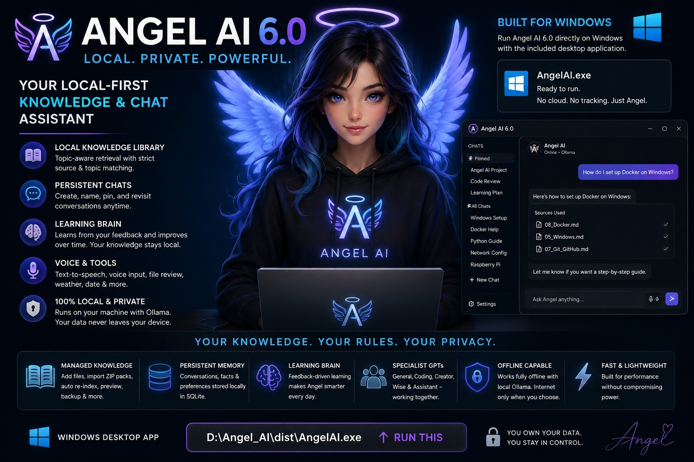

# Angel AI 6.0 — Local-First Knowledge & Chat Assistant

> **Ownership:** Angel AI is proprietary software owned by **TCD_Overlord / Talented Creative Design**. This repository is provided for personal, non-commercial study, learning, evaluation, and educational use. Commercial use requires prior written permission. See [`LICENSE.md`](LICENSE.md).

<p align="center">
  
  
  
  
  
  
</p>

<p align="center">
  
  
  
  
  
</p>

<p align="center">
  
  
  
  
</p>

**Angel AI** is a Windows desktop assistant built around local **Ollama**, authoritative local knowledge, specialist GPT profiles, persistent memory, a Learning Brain, local file review, voice controls, and persistent conversations.

<p align="center">
  
</p>

---

## Technology Stack

| Area | Technology |
|---|---|
| Language | Python |
| Desktop UI | Tkinter |
| Local LLM | Ollama |
| Persistence | SQLite |
| Packaging | PyInstaller |
| Speech | Windows text-to-speech via `pyttsx3` |
| Knowledge | Managed local Markdown/text/code sources |
| Build Target | Windows desktop |

# Architecture

Angel uses a layered architecture in which the **application controls state, routing, knowledge provenance, and GPT identity**, while Ollama provides the local language-model engine for general knowledge and reasoning.

```text
                              ┌─────────────────────────┐
                              │          USER           │
                              └────────────┬────────────┘
                                           │
                                           ▼
                              ┌─────────────────────────┐
                              │        ANGEL UI         │
                              │     Windows / Tk GUI    │
                              │  Chats • Themes • Voice │
                              └────────────┬────────────┘
                                           │
                                           ▼
                              ┌─────────────────────────┐
                              │       ANGEL BRAIN       │
                              │    Main Orchestrator    │
                              └────────────┬────────────┘
                                           │
              ┌────────────────────────────┼────────────────────────────┐
              │                            │                            │
              ▼                            ▼                            ▼
   ┌────────────────────┐       ┌────────────────────┐       ┌────────────────────┐
   │   SPECIALIST GPTs  │       │  LOCAL KNOWLEDGE   │       │    PERSISTENCE     │
   │                    │       │                    │       │                    │
   │ Angel              │       │ Topic routing      │       │ Conversations      │
   │ Python Engineer    │       │ Source retrieval   │       │ Facts / memory     │
   │ Novel Baker        │       │ Source truth       │       │ Learning database  │
   │ Moonlit Storyroom  │       │ Knowledge backups  │       │ GPT state          │
   └─────────┬──────────┘       └─────────┬──────────┘       └─────────┬──────────┘
             │                            │                            │
             └────────────────────────────┼────────────────────────────┘
                                          │
                                          ▼
                              ┌─────────────────────────┐
                              │         OLLAMA          │
                              │   Local Model Engine    │
                              │ General Knowledge +     │
                              │ Reasoning + Local       │
                              │ Knowledge Context       │
                              └────────────┬────────────┘
                                           │
                                           ▼
                              ┌─────────────────────────┐
                              │    ANGEL FINAL ANSWER   │
                              │  Application Source     │
                              │     Truth / Status      │
                              └─────────────────────────┘
```

## Local Knowledge + Ollama

```text
User Question
      │
      ▼
Application Routing
      │
      ▼
Active GPT / Allowed Knowledge Scope
      │
      ▼
Relevant Local Knowledge?
    ┌─┴───────────────┐
   YES               NO
    │                 │
    ▼                 ▼
Local Context      No Local Context
    │                 │
    └────────┬────────┘
             ▼
           Ollama
             │
             ▼
      Final Angel Answer
```

When relevant local knowledge exists, Angel passes it to Ollama as additional authoritative context.

When relevant local knowledge does not exist, Angel can still use Ollama's general model knowledge.

**Ollama does not own Angel's application state or provenance.**

---

# What Is Angel AI?

Angel AI combines:

- **Ollama** for general model knowledge and reasoning
- **Managed local knowledge** for authoritative project-specific information
- **Specialist GPT profiles** for focused domains
- **Persistent SQLite storage** for conversations, facts, learning, and GPT state
- **Local file review**
- **Learning Brain**
- **Windows text-to-speech**
- **Dark and light themes**
- **Application-owned source truth and provenance**
- **Visible thinking status** while a response is being generated

Angel is intended to run locally and does not require a cloud AI provider for normal Ollama conversation.

---

# Quick Start — Windows

## Build

```powershell
cd D:\Angel_AI
.\BUILD-EXE.bat
```

The build process creates persistent directories, validates Python, validates the Learning Brain schema, checks knowledge, builds the Windows executable, and verifies that persistent runtime data was not bundled.

## Run

**The Windows executable is in the `dist` folder.**

```powershell
.\dist\AngelAI.exe
```

You can also use:

```powershell
.\START-ANGEL.bat
```

The executable is:

```text
D:\Angel_AI\dist\AngelAI.exe
```

Final application layout:

```text
D:\Angel_AI\
├── angel\
├── data\
├── dist\
│   └── AngelAI.exe        ← RUN THIS
├── docs\
├── tests\
├── AngelAI.spec
├── AngelAI_direct.py
├── BUILD-EXE.bat
├── START-ANGEL.bat
├── VERIFY-FINAL-BUILD.bat
├── requirements.txt
├── pyproject.toml
├── README.md
└── LICENSE.md
```

---

# Specialist GPT System

Current specialist examples:

```text
Angel
Python Engineer
Novel Baker
Moonlit Storyroom
```

Each specialist GPT can define:

```text
Name
Allowed knowledge domains
Preferred topics
System instructions
```

Examples:

```text
Python Engineer
└── technology
    └── python
```

```text
Novel Baker
└── novel_baker
```

```text
Moonlit Storyroom
└── moonlit_storyroom
```

A specialist GPT controls the **focus of local knowledge retrieval**. It does not disable Ollama's general model knowledge.

---

# Knowledge Architecture

Angel's knowledge library is managed independently from Ollama.

```text
Knowledge Library
       │
       ▼
Topic / Domain Routing
       │
       ▼
Relevant Source Retrieval
       │
       ▼
Authoritative Context
       │
       ▼
Ollama
       │
       ▼
Final Answer
```

The knowledge system can:

- add files;
- import ZIP knowledge packs;
- update sources;
- remove sources;
- re-index sources;
- preview sources;
- back up sources;
- choose a separate local knowledge folder;
- restrict retrieval by GPT, domain, and topic.

---

# Knowledge Truth

A core Angel principle is:

> **Source truth comes before confidence.**

Angel distinguishes:

```text
Knowledge Inventory
→ what exists locally

Retrieval Result
→ what was actually retrieved for this request

Ollama Knowledge
→ general model knowledge

Final Answer
→ response produced from the available context
```

The model must not invent:

- filenames;
- retrieval results;
- provenance;
- collections;
- application capabilities.

The application owns those facts.

---

# Memory and Persistence

Angel keeps **knowledge** and **memory** separate.

### Knowledge

```text
data\knowledge\
```

### Memory

```text
data\memory\
```

### Learning

```text
data\learning.db
data\learning_schema.sql
```

### GPT state

```text
data\gpts\
```

Persistent runtime state remains outside the PyInstaller executable.

---

# Learning Brain

The Learning Brain provides a local SQL-backed learning system.

```text
New Topic
   │
   ▼
Learning Brain
   │
   ▼
SQLite
   │
   ▼
Goal / Level / Progress
   │
   ▼
Angel Knowledge + Ollama Reasoning
```

---

# Conversations

Angel supports:

- New Chat
- Persistent previous chats
- Chat names
- Rename
- Delete
- Pin / unpin
- Pinned section
- All Chats section
- Reopen previous conversations
- SQLite conversation storage
- GPT association with conversation state

---

# File Review

A user-supplied file is treated as **temporary file context** unless deliberately added to the managed knowledge library.

This prevents temporary document review from automatically becoming permanent knowledge.

---

# Knowledge Management

The managed knowledge workflow supports:

```text
Add Files
Import ZIP
Update Selected
Remove Selected
Refresh / Re-index
Preview
Backup All
Choose Folder
```

Knowledge backups are kept separately from active knowledge and are not searched as active sources.

---

# Thinking Status

While Angel is processing, the interface displays:

```text
● THINKING
● THINKING.
● THINKING..
● THINKING...
```

The indicator remains active until a response or error result returns.

This is a **UI activity indicator only**. It does not expose hidden chain-of-thought or private reasoning.

---

# Themes and Chat UI

Angel supports:

```text
Dark Mode
Light Mode
```

Chat layout:

```text
Angel → left side
You   → right side
```

Both themes use readable, high-contrast text.

---

# Voice

Angel provides Windows text-to-speech controls including:

```text
Speak
Speak Last
Stop Voice
Replay
Auto Speak
```

---

# Runtime Data Location

Angel uses one persistent application data location:

```text
D:\Angel_AI\data\
```

The executable remains:

```text
D:\Angel_AI\dist\AngelAI.exe
```

Persistent application data stays outside PyInstaller's temporary `_MEI...` directory.

---

# Build System

Angel uses PyInstaller to build a one-file Windows executable.

Build output:

```text
dist\AngelAI.exe
```

The persistent `data\` directory is not bundled into the executable.

Run:

```powershell
.\VERIFY-FINAL-BUILD.bat
```

---

# Testing

Before release, verify:

```text
Angel launches
Ollama responds
Chat responds
Thinking indicator appears
Active GPT is reported correctly
Relevant local sources are retrieved
Unrelated sources are not treated as evidence
Normal questions still use Ollama
Questions without local knowledge still receive answers
Local knowledge can be combined with Ollama reasoning
Chats persist
GPT state persists
Learning persists
Dark mode is readable
Light mode is readable
dist\AngelAI.exe exists
dist\data does not exist
```

---

# Security and Privacy

Angel is designed as a local-first application.

Do **not** commit:

```text
data/
*.db
*.sqlite
*.sqlite3
*.log
.env
.env.*
credentials*
secrets*
tokens*
api_keys*
apikey*
api-key*
*.key
*.pem
*.pfx
*.p12
machine-info.json
local-config.json
hardware-report.json
build/
__pycache__/
```

Personal conversations, memory databases, settings, learning databases, runtime manifests, credentials, and machine-specific information should remain local.

---

# Recommended Public Repository Layout

```text
Angel-AI/
├── angel/
├── docs/
├── tests/
├── dist/
│   └── AngelAI.exe
├── AngelAI_direct.py
├── AngelAI.spec
├── BUILD-EXE.bat
├── INSTALL-WINDOWS.bat
├── START-ANGEL.bat
├── VERIFY-FINAL-BUILD.bat
├── VERIFY-KNOWLEDGE.bat
├── VERIFY-WINDOWS-BUILD.bat
├── TEST-KNOWLEDGE-ROUTING.bat
├── requirements.txt
├── pyproject.toml
├── README.md
├── LICENSE.md
└── .gitignore
```

---

# Project Principles

```text
Local-first
Application-owned state
Authoritative local knowledge
General Ollama reasoning
Strict source truth
Specialist GPT focus
Persistent local memory
Learning support
Transparent capabilities
No fabricated files
No fabricated capabilities
No fabricated retrieval
```

The goal is to make Angel **useful, understandable, inspectable, local-first, and honest about the difference between authoritative local knowledge and general model reasoning**.

---

# License and Ownership

**Angel AI is owned by TCD_Overlord / Talented Creative Design.**

Copyright © 2026 TCD_Overlord / Talented Creative Design. All rights reserved.

Angel AI is provided for **personal, non-commercial study, learning, evaluation, and educational use** unless separate written permission is granted.

Commercial use is **not permitted** without prior written authorization from **TCD_Overlord / Talented Creative Design**.

This includes selling Angel AI, incorporating Angel AI or substantial portions of it into a commercial product or service, paid SaaS or hosted use, commercial redistribution or resale, or public redistribution of modified versions without permission.

Private modifications for personal study are permitted subject to the terms of `LICENSE.md`.

Third-party libraries, models, and external components remain subject to their own licenses.

See [`LICENSE.md`](LICENSE.md) for the complete proprietary license terms.

**All rights not expressly granted are reserved by TCD_Overlord / Talented Creative Design.**
