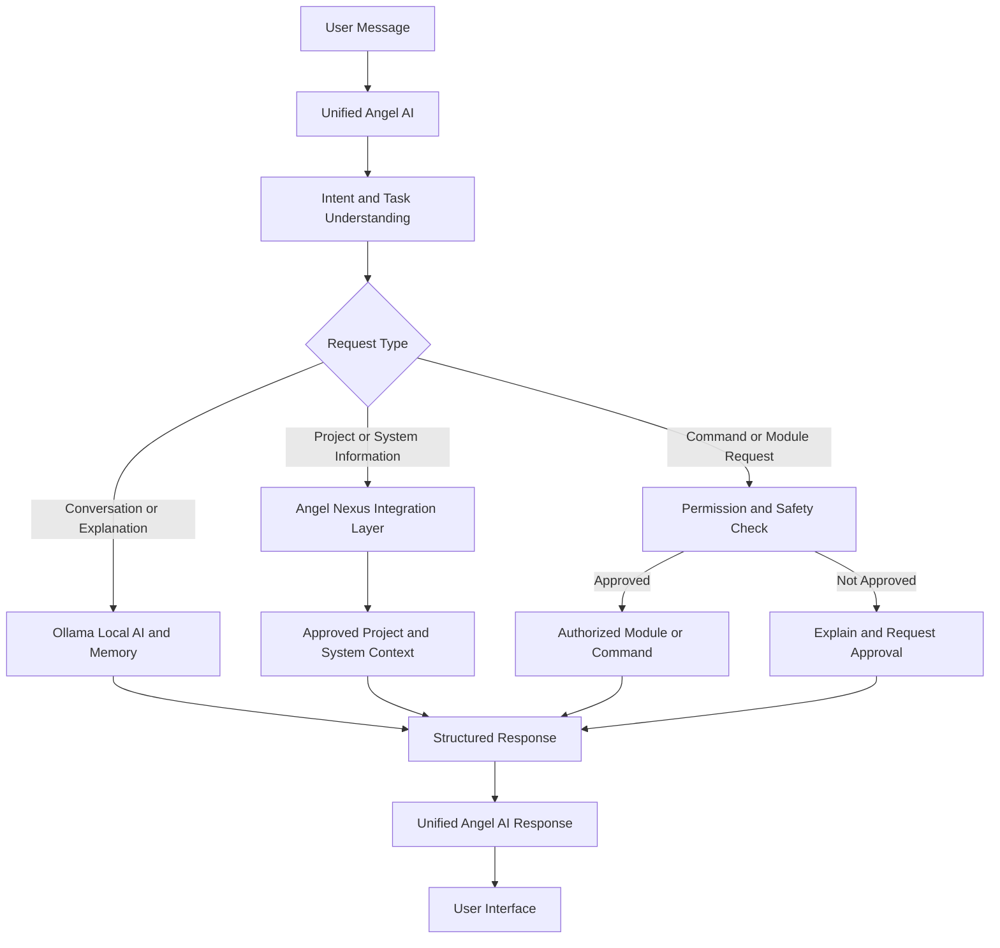
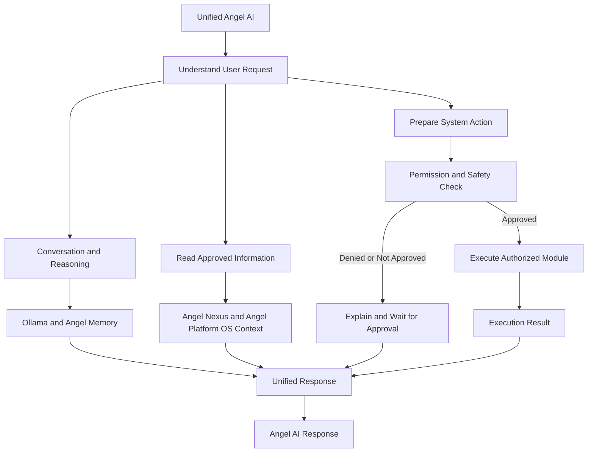

# Angel Platform 3.2.5

> **"Peace Be The Journey" --- Callan Palmer**

## Repair Mode Checkpoint: Weather and Forecast Integration

| Item | Current State |
|---|---|
| Project | Angel Nexus / Angel Platform |
| Developer | TCDOVERLORD |
| Checkpoint | `v3.2.5-repair-weather-forecast` |
| Status | Stable repair-mode checkpoint |
| Primary platform | Windows |
| AI engine | Local Ollama |
| Default weather location | New York, NY |
| Test location | Generic test location (not publicly specified) |
| Development folder | `D:\GitHub\Angel_AI` |

---
## Start Here

If you are visiting this repository for the first time, use the paths below:

- **Run from source:** Follow **Installation and First Launch**.
- **Use local AI:** Complete **Ollama Installation and Verification** after the basic setup.
- **Build the Windows application:** Follow **Building the Windows Executable**.
- **Understand or modify the project:** Continue into the architecture, repair, testing, and development sections.

The project uses **one unified Angel AI**, not separate Chat and Sys Chat interfaces. Angel AI is intended to support normal conversation, technical assistance, planning, and—through future controlled integrations—approved interaction with Angel Nexus and the personalized Angel Platform OS.

---

## Overview

Angel Platform is a local-first AI assistant and system-management foundation designed to combine:

- **One unified Angel AI Chat** for normal conversation, technical support, planning, and system assistance
- **Local Ollama** integration
- **Angel Nexus** monitoring, module access, and system integration
- Projects and registered system modules
- Approval-controlled workflows for system actions
- Persistent memory foundations
- Provider-backed live information such as weather and date/time
- A future personalized **Angel Platform OS** layer that Angel AI can access through Angel Nexus

The project is currently being developed in **Repair Mode**. Source code is edited, checked, and tested before creating a final Windows executable.

This approach allows individual features to be repaired and verified without rebuilding the executable after every change.

---

## System Requirements

Angel Platform supports Windows and Linux. Requirements vary depending on whether you are running the application from source, building the Windows executable, or using local AI through Ollama.

### Windows Requirements

#### Required

- Windows 10 or Windows 11 (64-bit recommended)
- Python **3.10 or newer** for source execution
- Python available through `python` or the Windows Python launcher
- Project dependencies installed from `requirements.txt`
- PowerShell
- Internet connection for downloading dependencies and optional AI models

---

### Linux Requirements

#### Current Linux Status

Linux support is currently limited to the basic **Angel AI Chat** experience.

The complete Linux installation process, required dependencies, supported distributions, and launch commands still need to be verified.

> **Development note:** Linux installation instructions will be expanded after testing the application on a supported Linux environment.

---
## Recommended First-Time Installation

For most Windows users, the goal is simple: **extract or clone the repository, build the Windows application once, and launch Angel Platform by clicking the EXE.**

This is the easiest Windows path for users who want to use Angel Platform rather than work directly with Python source code.

### Windows: Quick Click-and-Use Path

1. Install **Python 3.10 or newer**.
2. Install **Ollama for Windows** if you want local AI features.
3. Extract or clone the Angel Platform repository.
4. Open PowerShell in the repository folder.
5. Run the Windows build script:

```powershell
.\build_windows_exe.bat
```

6. After the build completes, open:

```text
dist\AngelPlatform\
```

7. Double-click:

```text
AngelPlatform.exe
```

You can also launch the packaged application with:

```text
RUN_WINDOWS.bat
```

### Important Windows Notes

- The build script creates the virtual environment, installs dependencies, validates the source, and builds the Windows application.
- The packaged application is an **onedir build**, so keep the entire `dist\\AngelPlatform\\` folder together.
- The build script deletes and recreates the `build` and `dist` directories. Back up an existing packaged application before rebuilding.
- Source-mode testing is still available in the **Installation and First Launch** section for troubleshooting and development.
- Administrator PowerShell may be useful for system-level setup, but do not grant elevation unless you trust the repository and understand what the script will execute.

---

## Installation and First Launch

Choose the platform you are using. **Windows users should first verify the source launch, then build the Windows executable for easy click-and-use launching. Linux users can run the Python application directly.**

### Windows: First-Time Setup

#### 1. Open PowerShell Run Ad Admin

```powershell
Set-Location "C:\Angel_AI"
```

If your repository is in another folder, use that folder instead.

#### 2. Create the virtual environment

```powershell
py -3 -m venv .venv
```

If the `py` launcher is unavailable:

```powershell
python -m venv .venv
```

#### 3. Install project dependencies

```powershell
.\.venv\Scripts\python.exe -m pip install --upgrade pip
.\.venv\Scripts\python.exe -m pip install -r requirements.txt
```

#### 4. Check Python syntax

```powershell
.\.venv\Scripts\python.exe -m compileall -q angel_platform run_angel_platform.py
```

A successful command normally produces no output.

#### 5. Verify Ollama if using local AI

Follow the **Ollama Installation and Verification** section below. Ollama is used for local AI inference.

#### 6. Start Angel Platform from source in Repair Mode

```powershell
.\.venv\Scripts\python.exe -u .\run_angel_platform.py
```

Keep the PowerShell window visible so startup errors can be reviewed.

The development server uses:

```text
http://127.0.0.1:8765/
```

#### 7. Build the Windows executable for easy launching

After source mode starts successfully, build the packaged Windows application:

```powershell
.\build_windows_exe.bat
```

The build script creates the Windows application in:

```text
dist\AngelPlatform\
```

The main executable is:

```text
dist\AngelPlatform\AngelPlatform.exe
```

You can now launch Angel Platform by double-clicking:

```text
dist\AngelPlatform\AngelPlatform.exe
```

You can also use the optional launcher:

```text
RUN_WINDOWS.bat
```

> **Build warning:** The build script deletes and recreates the `build` and `dist` directories. Back up any existing packaged application before rebuilding.

### Linux: Basic Source Launch

Linux currently provides the basic Python-based Angel AI Chat experience. Windows-specific executable packaging is not used on Linux.

#### 1. Open a terminal

Move into the repository:

```bash
cd /path/to/Angel-AI
```

Replace `/path/to/Angel-AI` with the actual repository location.

#### 2. Create a virtual environment

```bash
python3 -m venv .venv
```

#### 3. Activate the virtual environment

```bash
source .venv/bin/activate
```

#### 4. Install dependencies

```bash
python -m pip install --upgrade pip
python -m pip install -r requirements.txt
```

#### 5. Check Python syntax

```bash
python -m compileall -q angel_platform run_angel_platform.py
```

#### 6. Start Angel Platform

```bash
python -u ./run_angel_platform.py
```

Keep the terminal open while the application is running. If the application provides a browser interface, open the displayed local address, normally:

```text
http://127.0.0.1:8765/
```

> **Linux status:** Linux support is currently focused on basic source execution and Angel AI Chat. Windows executable packaging and some system-integration features are platform-specific and should not be assumed to be available on Linux.

---

## Ollama Installation and Verification

Angel Platform uses **Ollama** for local AI inference. The following configuration was verified on the developer's Windows system during this checkpoint:

| Component | Verified value |
|---|---|
| Ollama version | `0.33.3` |
| Installed model | `llama3.2:3b` |
| Model size shown by Ollama | Approximately `2.0 GB` |
| Ollama process | Running on Windows |

### Install Ollama

1. Install Ollama for Windows from the official Ollama website:
   `https://ollama.com/download/windows`
2. Open a new PowerShell window after installation.
3. Confirm that Ollama is available:

```powershell
ollama --version
```

4. Confirm that the required model is installed:

```powershell
ollama list
```

5. If the model is missing, download it:

```powershell
ollama pull llama3.2:3b
```

6. Confirm that the Ollama process is running:

```powershell
Get-Process ollama -ErrorAction SilentlyContinue
```

### Test Ollama directly

Run:

```powershell
ollama run llama3.2:3b
```

Type a short test message, then exit the interactive session as appropriate for your Ollama installation.

> **Version note:** `Ollama 0.33.3` and `llama3.2:3b` were verified in the development environment for this checkpoint. Before distributing a release, retest the application with the documented version and confirm that the model name matches the current source configuration. Do not assume that a different model will work without testing.

### Ollama troubleshooting

If Angel Platform cannot connect to Ollama:

- Confirm that `ollama --version` works.
- Confirm that `llama3.2:3b` appears in `ollama list`.
- Confirm that the Ollama process is running.
- Start Ollama if it is not running.
- Keep the Repair Mode PowerShell window open and inspect startup errors.
- Verify the model configured by the application matches the installed model.


## Optional Launch Scripts

These scripts are convenience options after installation or for development.
They are not the primary first-time installation path.


### Repair Mode

```text
RUN_REPAIR_MODE.bat
```

This launches the application from Python source and is intended for development and testing.

### Packaged Windows application

```text
RUN_WINDOWS.bat
```

This launches the existing packaged application if the following file exists:

```text
dist\AngelPlatform\AngelPlatform.exe
```

The packaged build is an **onedir** application. Preserve the entire directory:

```text
dist\AngelPlatform\
```

Do not copy or preserve only the `.exe`; supporting files are also required.

---


## Building the Windows Executable

Do not rebuild the final executable until the source build is stable and tested.

Before building, back up the current `build` and `dist` directories if they contain a working package. The build script removes and recreates these directories.

Run:

```powershell
.\build_windows_exe.bat
```

The build process:

1. Creates a virtual environment if needed.
2. Installs project dependencies.
3. Installs or updates PyInstaller.
4. Runs Python compilation checks.
5. Removes the existing `build` and `dist` directories.
6. Builds the application using `AngelPlatform.spec`.
7. Verifies that the executable exists.

Expected launch file:

```text
dist\AngelPlatform\AngelPlatform.exe
```

### Important build warning

The build script contains commands that delete the existing `build` and `dist` directories:

```bat
if exist build rmdir /s /q build
if exist dist rmdir /s /q dist
```

Back up any existing packaged build before running the build script.

---


## Runtime Details

| Item | Value |
|---|---|
| Development URL | `http://127.0.0.1:8765/` |
| Chat API | `POST http://127.0.0.1:8765/api/chat` |
| Default weather location | New York, NY |
| Test weather location | a local test location 46107 |
| Weather provider | Open-Meteo |

Do not assume the application uses port `8000`.

Close an existing Angel Platform instance before starting another session on port `8765`.

---


## Weather and Forecast Behavior

Angel uses deterministic provider-backed weather handlers rather than relying on Ollama to invent live weather information.

### Location resolution order

1. Approved device coordinates, when supplied
2. A location explicitly stated in the user's message
3. The default location: `New York, NY`

### Tested prompts

```text
What is the current weather?
```

Uses New York, NY when no location is supplied.

```text
What is the current weather in a local test location?
```

Geocodes the local test location and retrieves current weather.

```text
What is the weather going to be like tomorrow in a local test location 46107?
```

Uses the tomorrow forecast handler and returns the next-day forecast.

```text
What is the weather going to be like tomorrow?
```

Uses New York, NY as the default location.

### Provider

```text
Open-Meteo
```

Responses include provider attribution and forecast or observation timing.

---


## Repair Workflow

Use this sequence for controlled changes:

```text
Inspect the existing source
        |
        v
Explain the planned change
        |
        v
Back up important files
        |
        v
Make one controlled change
        |
        v
Run a Python syntax check
        |
        v
Stop the active Repair Mode session
        |
        v
Restart Repair Mode
        |
        v
Test through the actual Angel Platform UI
        |
        v
Document and verify the result
```

Do not make broad architectural changes without testing each change in Repair Mode.

---


## Safe Repair Commands

### Back up a source file

```powershell
Copy-Item `
    .\angel_platform\webui\server.py `
    .\angel_platform\webui\server.py.backup
```

For larger changes, use a dated backup folder outside the project repository.

### Check one Python file

```powershell
python -m py_compile .\angel_platform\webui\server.py
```

### Check the project source

```powershell
python -m compileall -q angel_platform run_angel_platform.py
```

### Start source mode

```powershell
python -u .\run_angel_platform.py
```

---


## Security and Repository Rules

Never commit local secrets or private runtime data.

The repository `.gitignore` excludes categories such as:

- `.env` files
- Virtual environments
- Python cache files
- Logs
- Local memory and history
- Vault data
- Credentials and secrets
- Encryption keys
- Tokens and sessions
- Local databases
- Build output and generated executables
- Backups and model files

Before committing, inspect the staged files:

```powershell
git add .
git diff --cached --name-status
git diff --cached --stat
```

Do not commit until the staged file list has been reviewed.

---


## Completed Tests

### Current weather

a local test location testing returned:

- Current temperature
- Feels-like temperature
- Conditions
- Humidity
- Wind speed
- Observation time
- Open-Meteo attribution

### Tomorrow forecast

The API test returned a forecast for:

```text
2026-09-19
```

The result included:

- High temperature
- Low temperature
- Conditions
- Precipitation probability
- Maximum wind
- Open-Meteo attribution

### Windows UI

The same forecast behavior was verified through the Windows UI in Repair Mode.

Confirmed:

- City-based forecast works.
- New York default forecast works.
- Forecast output displays correctly.
- Degree-symbol encoding was corrected.

---


## Known Limitations and Next Improvements

### Weather improvements

- Add hourly forecast support.
- Add severe weather alerts where available.
- Improve natural-language forecast formatting.
- Format dates as readable text.
- Add clearer timezone labeling.
- Support questions such as:
  - "Will it rain tomorrow?"
  - "Do I need a jacket?"
  - "What time will rain start?"
  - "What will the weather be like this weekend?"
- Consider retaining the last confirmed location during the current conversation.
- Keep provider failures transparent and clearly worded.

### Conversation improvements

- Preserve relevant context within a conversation.
- Distinguish current weather, tomorrow's forecast, and multi-day forecasts.
- Prevent Ollama from claiming live information is unavailable when a deterministic provider route exists.
- Improve combined date, time, weather, and system-information responses.
- Keep conversational reasoning distinct from controlled system actions while using one unified AI interface.

### Architecture improvements

- Continue separating deterministic actions from ordinary Ollama conversation.
- Add unit tests for location parsing.
- Add tests for city, state, and ZIP-code prompts.
- Add structured logging for provider failures.
- Add safe fallback behavior when the weather provider is unavailable.

---

## Architecture Flow

Angel Platform is designed around one unified Angel AI interface. The same AI can support normal conversation, technical assistance, planning, system information, and authorized module execution.

The AI's workflow changes based on the user's request, but the user experience remains unified.



Angel AI maintains one conversational experience while using controlled workflows for different types of requests.

System-changing actions must require clear user approval before execution.

---

## Unified Angel AI Architecture

Angel Platform is designed around **one unified Angel AI**, not separate Chat and Sys Chat systems.

The unified Angel AI is intended to support:

- Normal conversation and general questions.
- Explanations, planning, and creative work.
- Windows and Linux troubleshooting.
- Project and application assistance.
- Access to approved information from Angel Nexus.
- Access to approved information from the personalized Angel Platform OS.
- Discovery of available modules and tools.
- Preparation of diagnostic and administrative workflows.
- Permission requests before system-changing actions.
- Execution of approved commands and modules through controlled interfaces.
- Clear reporting of command output, system information, and errors.
- Appropriate project and memory context across conversations.

### Angel Nexus and Angel Platform OS Integration

Angel AI remains the primary conversational interface.

Angel Nexus acts as the controlled integration layer between the AI and available tools, modules, system information, and future Angel Platform OS capabilities.

The future Angel Platform OS is intended to provide a personalized operating environment that Angel AI can assist with through approved integrations.

The AI should not receive unrestricted system access automatically. Access should be:

- Permission-controlled.
- Limited to exposed capabilities.
- Auditable where applicable.
- Separated from unrestricted operating-system access.
- Protected by execution limits and safety checks.
- Clear about the difference between proposed actions and completed actions.

### Unified Workflow Concept



This architecture keeps the user experience unified while separating conversational reasoning from controlled system access.

Angel AI may eventually assist with Angel Nexus and the personalized Angel Platform OS, but those capabilities must be implemented and verified before being treated as available functionality.

---

## Current Project Tree

The following tree is a documentation summary of the current Angel Platform project.

```text
D:\GitHub\Angel_AI\
|
|-- angel_platform\
|   |-- app.py
|   |-- builder.py
|   `-- webui\
|       `-- server.py
|
|-- assets\
|-- scripts\
|-- tests\
|-- dist\
|   `-- AngelPlatform\
|       `-- AngelPlatform.exe
|
|-- run_angel_platform.py
|-- RUN_WINDOWS.bat
|-- RUN_REPAIR_MODE.bat
|-- build_windows_exe.bat
|-- AngelPlatform.spec
|-- requirements.txt
|-- pyproject.toml
`-- README.md
```

The tree is provided for documentation purposes.

**Always inspect the actual directory before assuming that every listed file, folder, or executable is present.** The project structure may change as development continues.

---

## Leave-Off Checkpoint

```text
Angel Platform 3.2.5
Repair Mode running successfully
Current weather working
Tomorrow forecast working
the local test location weather working
New York default location working
Degree-symbol encoding fixed
Windows UI verified
Existing EXE preserved
README installation instructions updated, including the administrator build path and unified Angel AI architecture
```

### Do not do yet

- Do not rebuild the final executable yet.
- Do not delete or replace the existing packaged build.
- Do not assume every future weather question is supported.
- Do not allow Ollama to fabricate live weather data.
- Do not make broad architectural changes without testing each change in Repair Mode.
- Do not push to GitHub until the staged contents and remote configuration are reviewed.

---

The existing GitHub repository is:

```text
https://github.com/tcdoverlord/Angel-AI
```

Do not force-push or replace remote history until the existing remote state has been inspected and a safe migration plan has been confirmed.
