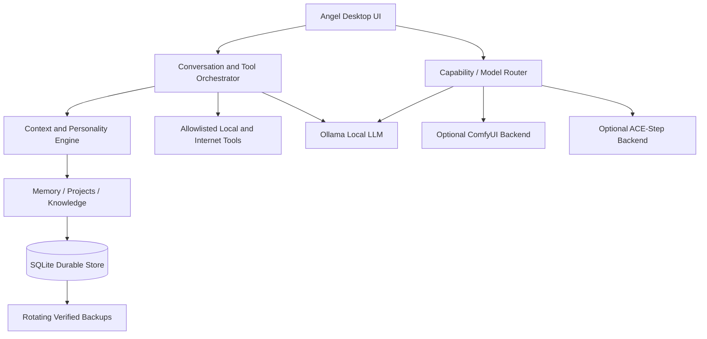

# Angel AI

**A local-first, offline-capable personal AI assistant for Windows**

Angel is a native Windows desktop application built around local language-model
inference, durable personal context, and explicit separation between private user data
and disposable application cache. Ollama provides the replaceable local language
engine; Angel provides the identity, context assembly, memory, projects, knowledge,
tools, backups, diagnostics, voice, and interface.

The repository contains source code, tests, documentation, and a reproducible Windows
build pipeline. It intentionally excludes private runtime data and generated binaries.

## Engineering Highlights

- Designed an offline-first desktop AI architecture around localhost Ollama inference.
- Built persistent conversation, long-term memory, project, knowledge, settings, and
  creator-metadata systems on SQLite.
- Separated disposable cache from durable data and tested that cache clearing causes
  zero loss of conversations, memories, projects, or settings.
- Implemented rotating SQLite backups, validated restoration, integrity checks, and
  corrupt-database preservation/recovery.
- Added automatic Ollama installation, service, model, storage, and hardware discovery.
- Designed capability routing for chat, coding, vision, embedding, image, and music
  engines without making those engines Angel's identity.
- Integrated replaceable localhost APIs for ComfyUI image generation and ACE-Step music
  generation, with graceful degradation when either service is unavailable.
- Built automated offline, persistence, migration, cache-survival, recovery, tool-safety,
  attachment, speech, and UI regression tests.
- Packaged the application as a native Windows executable with PyInstaller.

## Overview

Angel focuses on the less visible engineering needed to make a local assistant useful:
continuity across sessions, bounded model context, honest capability reporting,
recoverable storage, safe tool execution, optional-service isolation, and a practical
desktop interface.

The application can:

- hold multiple searchable conversations;
- deliberately remember important facts without treating every chat line as memory;
- continue named projects with state, decisions, tasks, notes, and file references;
- index local reference files in a private Knowledge Library;
- use Windows-installed text-to-speech voices;
- search the public web only when the selected connectivity mode permits it;
- connect to optional local image and music services; and
- remain usable when internet access or optional creator backends are unavailable.

No cloud AI subscription or account is required for core local conversation after
Ollama and a compatible model are installed.

## Why I Built It

The engineering goal was to build a personal AI system whose core operation and
continuity stay under the user's control. A local model alone is not a complete
assistant: the surrounding application must manage identity, context, durable state,
safe tools, failure modes, resource usage, and recovery.

Angel explores that complete application layer while keeping its language model and
optional creator engines replaceable.

## Architecture



Angel's application layer owns its personality and behavior. Ollama, ComfyUI, and
ACE-Step are specialized engines beneath that layer rather than separate user-facing
identities.

### Major components

| Component | Responsibility |
|---|---|
| `angel/ui.py` | Native Tkinter interface and background-task coordination |
| `angel/brain.py` | Conversation flow, tool loop, cancellation, and response persistence |
| `angel/personality.py` | Identity, communication behavior, and truthfulness rules |
| `angel/context.py` | Bounded assembly of recent chat, summaries, projects, memory, and knowledge |
| `angel/database.py` | SQLite schema, migrations, transactions, integrity, and connection lifecycle |
| `angel/backups.py` | Consistent snapshots, rotation, validation, restore, and corruption recovery |
| `angel/memory.py` | Intentional memory, relevance scoring, consolidation, metadata, and deletion |
| `angel/projects.py` | Durable project state, records, and active-project continuity |
| `angel/knowledge.py` | Local ingestion, chunking, deduplication, indexing, and retrieval |
| `angel/local_ai.py` | Ollama discovery/startup, installed models, hardware, and recommendations |
| `angel/creator.py` | ComfyUI, ACE-Step, Creator Library, and capability routing |
| `angel/tools.py` | Strict tool allowlist, validation, permission metadata, limits, and logging |
| `angel/diagnostics.py` | Non-sensitive local health and capability reporting |

## Key Features

### Chat and continuity

- Persistent conversations with search, rename, and confirmed deletion.
- Enter to send and Shift+Enter for a new line.
- Stop Generating, Regenerate, Copy Reply, and Reuse Prompt controls.
- Selectable conversation text, Markdown-style fenced code rendering, clickable sources,
  clickable local attachments, and attachment indicators.
- Bounded recent history plus deterministic older-conversation summaries; original
  messages remain stored.

### Memory, projects, and knowledge

- Deliberate long-term memory with categories, importance, confidence, tags, source
  conversation, last-used time, editing, search, consolidation, and deletion.
- Project state with decisions, open tasks, completed work, ideas, notes, activities,
  and file references.
- Active and relevant projects automatically contribute bounded context.
- Local Knowledge Library with durable source copies, incremental ingestion, duplicate
  detection, bounded chunks, persistent metadata, local retrieval, reindex, and removal.
- No hosted vector database and no required knowledge-service account.

### Local AI and connectivity

- Local Ollama inference with no hidden cloud fallback.
- Automatic detection of common Windows Ollama locations and optional service startup.
- Installed-model inventory, model sizes, storage location, real inference test, and
  hardware-aware Lightweight/Balanced/Powerful guidance.
- **Offline**, **Local + Internet Tools**, and **Auto** connectivity modes.
- **Low Resource**, **Balanced**, and **Maximum Quality** context profiles.
- Separate model-role settings for chat, coding, vision, embeddings, images, and music.

### Files, speech, and tools

- Arbitrary multi-file attachment support without an extension allowlist.
- Local extraction where supported for text, Markdown, JSON, CSV, source code, HTML,
  PDF, DOCX, and XLSX, plus basic common-media metadata.
- Honest metadata-only handling for unsupported formats.
- Installed Windows text-to-speech voices with automatic reading, replay, stop, voice
  choice, and speed control.
- Strictly allowlisted tools with permission levels, schemas, timeouts, error handling,
  activity logging, and a bounded tool-call loop.

### Optional creator integrations

- ComfyUI text-to-image workflow with prompt, negative prompt, dimensions, steps,
  checkpoint, seed, local output, and persistent generation metadata.
- ACE-Step music workflow with title, description, genre, mood, lyrics,
  vocal/instrumental mode, vocal style, duration, seed, WAV output, and playback.
- Unified Creator Library metadata for images and songs.
- Creator failures are isolated; chat, memory, projects, and other local features remain
  available when creator services are absent.

## Offline-First Design

Offline mode enforces a localhost Ollama endpoint and blocks public search-tool use.
Angel does not equate “offline” with “the UI opens”: the acceptance path exercises real
local inference, then restarts the service composition and checks continuity.

The verified offline acceptance run used an installed `llama3.2:3b` model and confirmed:

- three local responses completed;
- zero external search-provider calls occurred;
- conversations, memory, project state, and settings survived restart;
- disposable cache was removed and recreated; and
- local conversation continued after restart.

## Data Protection

Angel deliberately separates durable information from rebuildable or disposable state:

```text
<Angel installation>\
├── data\                  durable database, logs, indexes, and generated media
│   └── angel.db           conversations, memory, projects, settings, and metadata
├── backups\               rotating validated database snapshots
├── knowledge\             durable Knowledge Library source copies
├── projects\              reserved durable project workspace
├── creator\               durable creator workspace
├── models\                reserved Angel-managed model space
└── cache\                 disposable and automatically recreated
```

Important safeguards include:

- SQLite foreign keys, WAL mode, transactions, busy timeouts, and integrity checks;
- atomic JSON configuration writes;
- SQLite's online backup API instead of copying an actively changing database;
- backup manifests and validation before restore;
- a safety backup before replacing the current database;
- preservation of a corrupt database before recovery; and
- explicit regression tests proving cache deletion does not erase durable state.

The former LocalAppData database location is migrated once only when the new database
does not already exist. It never overwrites a newer database.

## Testing

The current verified baseline is:

```text
60/60 automated tests passed
```

Additional acceptance results performed on the packaged Windows application:

- packaged UI startup: passed;
- live local-model inference: passed;
- offline acceptance: passed;
- database integrity: passed;
- backup and restoration: passed;
- cache-survival persistence: passed; and
- Windows installed-voice detection: passed.

The normal pytest suite uses mocked external services and requires neither public
internet access nor a running Ollama service:

```powershell
python -m pytest -q tests
```

GitHub Actions runs the same suite on Windows for pushes and pull requests.

## Technology

- Python 3 and the standard library
- Tkinter native Windows desktop UI
- SQLite
- Ollama localhost HTTP API
- ComfyUI localhost API integration
- ACE-Step 1.5 localhost API integration
- Windows SAPI voices through PowerShell
- `pypdf` for local PDF text extraction
- pytest
- PyInstaller
- Git and GitHub Actions

## Engineering Challenges

### Separating local inference from internet state

Ollama runs on localhost and must continue operating when the external network is down.
Connectivity policy is enforced at tool planning and execution boundaries rather than
being inferred from one generic “online” indicator.

### Protecting durable state from cleanup tools

Cache, model caches, and build artifacts are common cleanup targets. Angel assigns
durable and disposable responsibilities to separate directories and tests the boundary
by deleting cache and reopening the database.

### Maintaining useful context without loading everything

Every turn receives layered, bounded context: personality and truth rules, user
preferences, active/relevant projects, relevant long-term memory, relevant knowledge,
older-conversation summaries, recent messages, and verified tool results.

### Recovering safely on Windows

Windows file locking exposed an important database lifecycle issue during restore
testing. Connections now close deterministically, database backups use SQLite's backup
API, and restore/recovery stages replacement files within the durable data volume.

### Isolating optional AI services

Image and music stacks can consume significant disk, RAM, and GPU resources. Angel
detects and invokes them only when requested. Missing services produce actionable local
status instead of breaking the main assistant.

## Building and Running

### Requirements

- Windows 10 or Windows 11
- Python 3 with Tk support
- Ollama for local conversation
- A locally installed Ollama model

Angel never downloads a large model silently. A lightweight starting point is:

```powershell
ollama pull llama3.2:3b
```

### Run from source

```powershell
python -m pip install -r requirements.txt
python angel.py
```

Alternatively, double-click `RUN-ANGEL.bat`.

### Build the Windows application

```powershell
.\BUILD-ANGEL.bat
```

The build script creates or reuses `.venv`, installs declared dependencies, runs the
complete test suite, stops if testing fails, and packages the application. The launcher
is written to `Angel.exe`; its adjacent `_internal` folder is required at runtime.

Generated executables and runtime packages are reproducible and intentionally excluded
from Git history.

## Privacy

This public repository contains application source, tests, documentation, and build
automation only. `.gitignore` and publication checks exclude:

- conversations, memories, settings, and SQLite databases;
- logs, cache, backups, and local Knowledge Library documents;
- generated images, music, and other private media;
- local model weights and creator checkpoints;
- `.env` files, credentials, tokens, keys, and certificates; and
- generated executables and packaged runtime files.

Angel has no telemetry or analytics. Public web searches necessarily send their query
to the configured public search provider; Offline mode blocks that tool.

## Current Limitations

- Response quality depends on the selected local model and available hardware.
- ComfyUI and ACE-Step require separate local installations and model files; they are
  not bundled or automatically downloaded.
- ComfyUI image-to-image, image editing, and in-app image previews are not implemented.
- OCR, audio transcription, and video understanding are not currently implemented.
- The coding-role architecture exists, but unrestricted autonomous shell or coding
  execution is intentionally not provided.
- Stop Generating prevents a late result from being displayed or stored, but the active
  Ollama HTTP request can continue internally until it returns or times out.
- Knowledge retrieval is intentionally lightweight and local rather than a hosted
  enterprise vector database.

For a deliberately simple tour of the implementation, see
[`WHAT-I-BUILT-SIMPLE.md`](WHAT-I-BUILT-SIMPLE.md).

No license file is currently included. Repository visibility does not by itself grant
permission to reuse the code.
